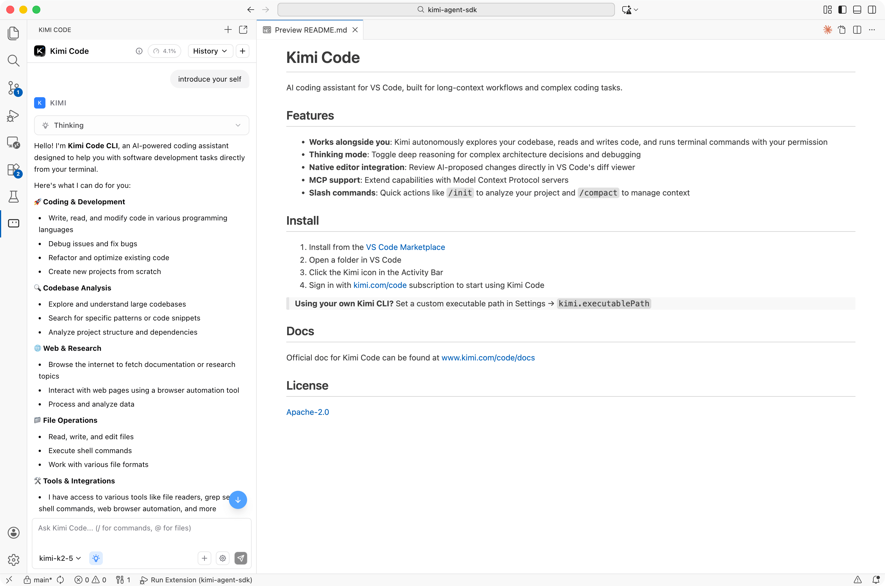

# Kimi CLI (Archived)

[Kimi Code CLI](https://github.com/MoonshotAI/kimi-code) | [Migration Guide](https://moonshotai.github.io/kimi-code/en/guides/migration) | [迁移指南](https://moonshotai.github.io/kimi-code/zh/guides/migration) | [Legacy Docs](https://moonshotai.github.io/kimi-cli/en/)

> [!CAUTION]
> **This project has been archived and is no longer maintained.** Kimi CLI (Python) has been replaced by **[Kimi Code CLI](https://github.com/MoonshotAI/kimi-code)**, the next-generation terminal AI agent from the same team.
>
> - This repository is read-only. There will be no further releases, bug fixes, or security updates.
> - Existing installations are no longer supported and will stop working. Please migrate as soon as possible.
> - Please file issues, feature requests, and security reports for Kimi Code CLI at [MoonshotAI/kimi-code](https://github.com/MoonshotAI/kimi-code).
>
> 本项目已归档，不再维护。Python 版 Kimi CLI 已由 [Kimi Code CLI](https://github.com/MoonshotAI/kimi-code) 取代，旧版将无法继续使用，请参考[迁移指南](https://moonshotai.github.io/kimi-code/zh/guides/migration)尽快升级。

## Migrate to Kimi Code CLI

1. Install Kimi Code CLI:

   ```sh
   # macOS / Linux
   curl -fsSL https://code.kimi.com/kimi-code/install.sh | bash
   ```

   ```powershell
   # Windows (PowerShell)
   irm https://code.kimi.com/kimi-code/install.ps1 | iex
   ```

   Also available via Homebrew (`brew install kimi-code`) and npm (`npm install -g @moonshot-ai/kimi-code`).

2. Open a new terminal and run `kimi`. On first launch, it detects your Kimi CLI data in `~/.kimi/` and offers to migrate your config, MCP servers, input history, and sessions. You can also run `kimi migrate` at any time. Your original data in `~/.kimi/` is never modified or deleted.
3. Run `/login` again, and re-authorize your MCP servers. Login credentials, MCP authorizations, and Kimi CLI plugins are not migrated.
4. Uninstall the legacy CLI after migrating, e.g. `uv tool uninstall kimi-cli` or `brew uninstall kimi-cli`.

See the full [migration guide](https://moonshotai.github.io/kimi-code/en/guides/migration) for details.

## Packages in this repository

All packages below are archived together with this repository. Published versions remain on PyPI, but will not receive any further updates.

| Package | Status |
|---|---|
| [`kimi-cli`](https://pypi.org/project/kimi-cli/) | Archived. Replaced by Kimi Code CLI |
| [`kimi-code`](https://pypi.org/project/kimi-code/) on PyPI | Archived. A legacy alias of `kimi-cli`, **not** the new Kimi Code CLI |
| [`kosong`](https://pypi.org/project/kosong/) | Archived |
| [`pykaos`](https://pypi.org/project/pykaos/) | Archived |
| [`kimi-sdk`](https://pypi.org/project/kimi-sdk/) | Archived |

## License

The source code remains available under the [Apache License 2.0](LICENSE).

Thank you to everyone who used Kimi CLI, reported issues, and contributed code. Your feedback shaped Kimi Code CLI.

<details>
<summary>Original README (legacy, for reference only)</summary>

Kimi CLI is an AI agent that runs in the terminal, helping you complete software development tasks and terminal operations. It can read and edit code, execute shell commands, search and fetch web pages, and autonomously plan and adjust actions during execution.

## Getting Started

See [Getting Started](https://moonshotai.github.io/kimi-cli/en/guides/getting-started.html) for how to install and start using Kimi CLI.

## Key Features

### Shell command mode

Kimi CLI is not only a coding agent, but also a shell. You can switch the shell command mode by pressing `Ctrl-X`. In this mode, you can directly run shell commands without leaving Kimi CLI.


> [!NOTE]
> Built-in shell commands like `cd` are not supported yet.

### VS Code extension

Kimi CLI can be integrated with [Visual Studio Code](https://code.visualstudio.com/) via the [Kimi Code VS Code Extension](https://marketplace.visualstudio.com/items?itemName=moonshot-ai.kimi-code).



### IDE integration via ACP

Kimi CLI supports [Agent Client Protocol] out of the box. You can use it together with any ACP-compatible editor or IDE.

[Agent Client Protocol]: https://github.com/agentclientprotocol/agent-client-protocol

To use Kimi CLI with ACP clients, make sure to run Kimi CLI in the terminal and send `/login` to complete the login first. Then, you can configure your ACP client to start Kimi CLI as an ACP agent server with command `kimi acp`.

For example, to use Kimi CLI with [Zed](https://zed.dev/) or [JetBrains](https://blog.jetbrains.com/ai/2025/12/bring-your-own-ai-agent-to-jetbrains-ides/), add the following configuration to your `~/.config/zed/settings.json` or `~/.jetbrains/acp.json` file:

```json
{
  "agent_servers": {
    "Kimi CLI": {
      "type": "custom",
      "command": "kimi",
      "args": ["acp"],
      "env": {}
    }
  }
}
```

Then you can create Kimi CLI threads in IDE's agent panel.


### Zsh integration

You can use Kimi CLI together with Zsh, to empower your shell experience with AI agent capabilities.

Install the [zsh-kimi-cli](https://github.com/MoonshotAI/zsh-kimi-cli) plugin via:

```sh
git clone https://github.com/MoonshotAI/zsh-kimi-cli.git \
  ${ZSH_CUSTOM:-~/.oh-my-zsh/custom}/plugins/kimi-cli
```

> [!NOTE]
> If you are using a plugin manager other than Oh My Zsh, you may need to refer to the plugin's README for installation instructions.

Then add `kimi-cli` to your Zsh plugin list in `~/.zshrc`:

```sh
plugins=(... kimi-cli)
```

After restarting Zsh, you can switch to agent mode by pressing `Ctrl-X`.

### MCP support

Kimi CLI supports MCP (Model Context Protocol) tools.

**`kimi mcp` sub-command group**

You can manage MCP servers with `kimi mcp` sub-command group. For example:

```sh
# Add streamable HTTP server:
kimi mcp add --transport http context7 https://mcp.context7.com/mcp --header "CONTEXT7_API_KEY: ctx7sk-your-key"

# Add streamable HTTP server with OAuth authorization:
kimi mcp add --transport http --auth oauth linear https://mcp.linear.app/mcp

# Add stdio server:
kimi mcp add --transport stdio chrome-devtools -- npx chrome-devtools-mcp@latest

# List added MCP servers:
kimi mcp list

# Remove an MCP server:
kimi mcp remove chrome-devtools

# Authorize an MCP server:
kimi mcp auth linear
```

**Ad-hoc MCP configuration**

Kimi CLI also supports ad-hoc MCP server configuration via CLI option.

Given an MCP config file in the well-known MCP config format like the following:

```json
{
  "mcpServers": {
    "context7": {
      "url": "https://mcp.context7.com/mcp",
      "headers": {
        "CONTEXT7_API_KEY": "YOUR_API_KEY"
      }
    },
    "chrome-devtools": {
      "command": "npx",
      "args": ["-y", "chrome-devtools-mcp@latest"]
    }
  }
}
```

Run `kimi` with `--mcp-config-file` option to connect to the specified MCP servers:

```sh
kimi --mcp-config-file /path/to/mcp.json
```

### More

See more features in the [Documentation](https://moonshotai.github.io/kimi-cli/en/).

## Development

To develop Kimi CLI, run:

```sh
git clone https://github.com/MoonshotAI/kimi-cli.git
cd kimi-cli

make prepare  # prepare the development environment
```

Then you can start working on Kimi CLI.

Refer to the following commands after you make changes:

```sh
uv run kimi  # run Kimi CLI

make format  # format code
make check  # run linting and type checking
make test  # run tests
make test-kimi-cli  # run Kimi CLI tests only
make test-kosong  # run kosong tests only
make test-pykaos  # run pykaos tests only
make build-web  # build the web UI and sync it into the package (requires Node.js/npm)
make build  # build python packages
make build-bin  # build standalone binary
make help  # show all make targets
```

Note: `make build` and `make build-bin` automatically run `make build-web` to embed the web UI.

</details>
