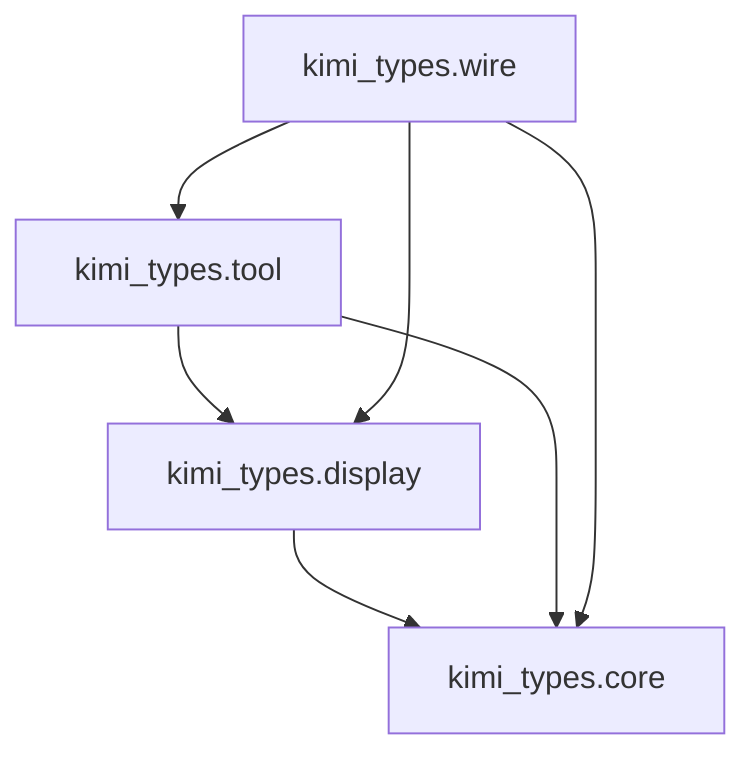
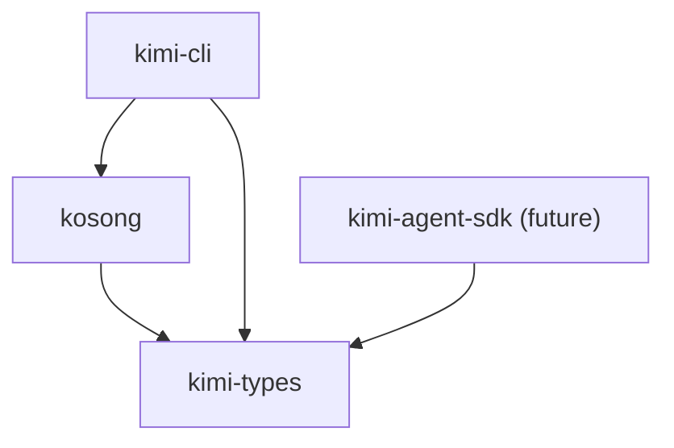

# KLIP-5: 提取 kimi-types 并梳理模块依赖

## 摘要

为 Kimi Agent Python SDK 提供统一、轻量、可复用的类型层。通过引入 `kimi-types`，把内容、工具、显示块与 Wire 协议模型从 `kosong` 和 `kimi-cli` 中抽离，形成稳定的类型边界，同时保持现有 API 兼容。

## 动机

目前类型散落于 `kosong` 与 `kimi-cli`：

- SDK 必须依赖 `kosong`（等同于 OpenAI SDK 层），耦合过重。
- Wire 协议类型与运行时实现混杂，跨项目复用困难。
- 类型定义分散，版本边界不清晰。

## 目标

- 提供纯数据模型（pydantic）集合，覆盖内容/工具/Wire 协议/显示块。
- `kimi-cli` 与 `kosong` 改为依赖 `kimi-types`，保持现有 API 兼容。
- Kimi Agent SDK 只依赖 `kimi-types`。

## 非目标

- 不迁移 `Wire` 传输实现（仍在 `src/kimi_cli/wire.py`）。
- 不重构 `kosong` 的运行时 API 或 ChatProvider 接口。
- 不引入 `kimi-wire` 新包。

## 设计

### 包与模块布局

- 新增 workspace 包：`packages/kimi-types`，模块名 `kimi_types`，包含 `py.typed`。
- 子模块：`kimi_types.{core,display,tool,wire}`。
- 顶层 `kimi_types` 仅 re-export `core`/`display`/`tool`，`wire` 需显式从子模块导入。

### 模块内容

#### kimi_types.core

- `JsonType`
- `MergeableMixin`
- `ContentPart` + 子类：`TextPart`/`ThinkPart`/`ImageURLPart`/`AudioURLPart`/`VideoURLPart`
- `ToolCall`、`ToolCallPart`
- `Role`、`Message`
- `TokenUsage`（BaseModel）

迁移自：`packages/kosong/src/kosong/message.py`、`packages/kosong/src/kosong/chat_provider/__init__.py`

#### kimi_types.display

- `DisplayBlock`、`BriefDisplayBlock`、`UnknownDisplayBlock`
- `DiffDisplayBlock`、`TodoDisplayBlock`、`TodoDisplayItem`

迁移自：`packages/kosong/src/kosong/tooling/__init__.py`、`src/kimi_cli/wire/display.py`

#### kimi_types.tool

- `ToolReturnValue`
- `ToolResult`

迁移自：`packages/kosong/src/kosong/tooling/__init__.py`

说明：`ToolOk`/`ToolError` 保留在 `kosong` 作为便捷封装。

#### kimi_types.wire

- Wire 消息模型：
  `TurnBegin`、`StepBegin`、`StepInterrupted`、`CompactionBegin`、`CompactionEnd`、`StatusUpdate`、
  `ContentPart`、`ToolCall`、`ToolCallPart`、`ToolResult`、`SubagentEvent`、
  `ApprovalRequest`、`ApprovalRequestResolved`
- 类型别名与检查：`Event`/`Request`/`WireMessage`、`is_event`/`is_request`/`is_wire_message`
- `WireMessageEnvelope`
- `serialize_wire_message`/`deserialize_wire_message`
- `WireMessageRecord`

迁移自：`src/kimi_cli/wire/message.py`、`src/kimi_cli/wire/serde.py`

### 依赖关系

模块依赖：

包级依赖（提取后）：

### ApprovalRequest 运行时处理

- `kimi_types.wire.ApprovalRequest` 内置运行时能力（与当前 CLI 实现一致）：
  - 内部持有 `_future`，实现 `wait/resolve/resolved`。
  - 类名保持 `ApprovalRequest`，避免 `WireMessageEnvelope` 的 `type` 变化。

### 文档更新

- Wire 文档新增 `VideoURLPart`：
  - `docs/en/customization/wire-mode.md`
  - `docs/zh/customization/wire-mode.md`

## 兼容性与迁移

- `kosong.message` 与 `kosong.tooling` 改为 re-export `kimi_types` 的同名类型。
- `kosong.chat_provider.TokenUsage` 改为从 `kimi_types.core` 引用或 re-export。
- `kimi_cli` 现有导入统一改向 `kimi_types`，避免类重复导致 `isinstance` 失效。
- 删除 `kimi_cli.wire.display` 与 `kimi_cli.wire.serde`，`kimi_cli.wire` 收敛为单文件模块
  `src/kimi_cli/wire.py`（仍只负责传输）。

## 落地结果

1. 新增 `packages/kimi-types` 包（workspace member），包含 `py.typed`。
2. 类型迁移至 `kimi_types.*` 并补全 `__all__`（顺序与定义一致）。
3. `kosong` 内部改引用并 re-export（保持旧路径可用）。
4. `kimi_cli` 引用更新为 `kimi_types`/`kimi_types.wire`，移除 `kimi_cli.wire.display`/`serde`。
5. `ApprovalRequest` 运行时能力落地到 `kimi_types.wire`。
6. Wire 文档补全 `VideoURLPart`。
7. 新增 `ci-kimi-types` 与 `release-kimi-types` 工作流，并将 `kimi-types` 依赖纳入
   `release-kimi-cli` 版本检查。

## 单元测试

- `packages/kimi-types/tests/` 覆盖 `core`/`display`/`tool`/`wire` 的序列化与注册行为。
- `test_exports.py` 对各模块 `__all__` 进行定义完整性 + 定义顺序检查。
- `test_exports.py` 对 `kimi_types.wire.__all__` 进行 wire message 存在性检查。
- `test_message.py`、`test_tool_result.py` 从 `packages/kosong/tests/` 迁移至 `packages/kimi-types/tests/`。
- `tests/test_wire_message.py` 迁移到 `packages/kimi-types/tests/`，直接测试 `kimi_types.wire`。
- `packages/kosong/tests/` 保持现有 import（`kosong.message`/`kosong.tooling`），用于验证 re-export 兼容。
- `tests/test_diff_utils.py`、`tests/test_acp_convert.py` 等 CLI 级测试继续导入 `kimi_types`。

## 风险与缓解

- **类型重复定义**：若 `kosong.message` 仍保留原定义，会导致 `isinstance` 失效；需全部改为 re-export。
- **注册表初始化**：`ContentPart`/`DisplayBlock` 子类注册依赖 import 顺序；需确保模块导入顺序一致。
- **pydantic 版本锁步**：`kimi-types` 必须与 `kosong`/`kimi-cli` 使用同一 major/minor 版本。
- **Wire 协议兼容**：`WireMessageEnvelope` 依赖类名；必须保持类名不变或引入显式 `wire_type`。
- **TokenUsage 迁移**：下游 ChatProvider 需要跟随调整 import，避免循环依赖或类型不一致。
