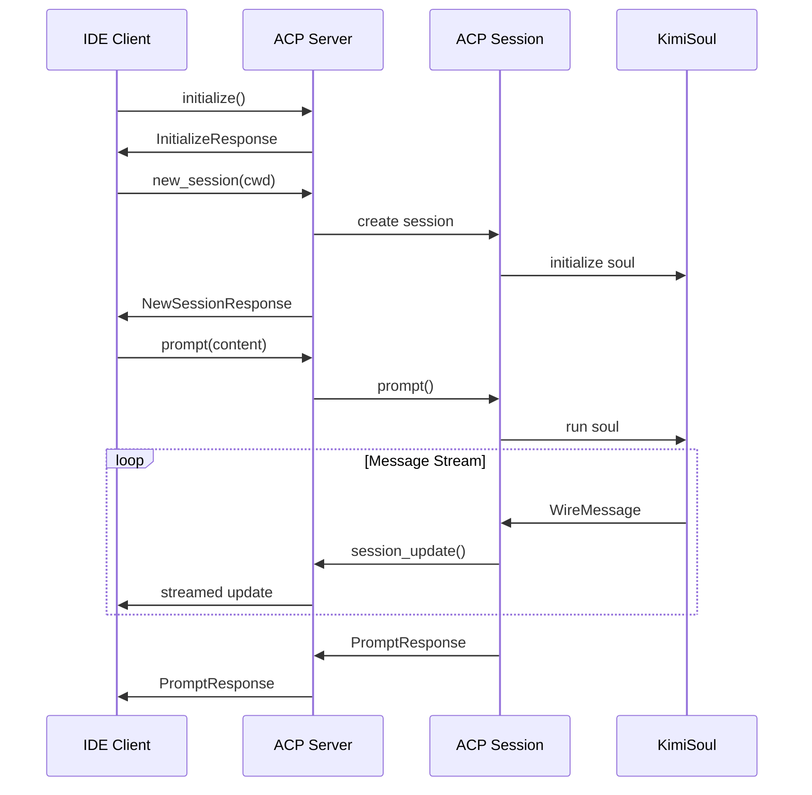

# Kimi CLI ACP 集成技术文档

## 概述

Agent Client Protocol (ACP) 是一个标准化的协议，允许 AI 代理与各种客户端（如 IDE、编辑器等）进行通信。Kimi CLI 实现了完整的 ACP 服务器，支持与多种开发环境无缝集成。

### 核心特性

- **标准化通信**: 基于 ACP 0.7.0 协议规范
- **多会话支持**: 支持同时管理多个会话
- **流式响应**: 实时流式传输消息内容
- **工具调用可视化**: 详细的工具执行状态展示
- **权限管理**: 集成用户确认机制
- **MCP 支持**: 支持 Model Context Protocol 扩展

## 架构设计

### 整体架构图

```
┌─────────────────┐    ACP Protocol    ┌─────────────────┐
│   IDE Client    │ ◄───────────────► │  Kimi CLI ACP   │
│  (Zed/JetBrains)│                   │    Server        │
└─────────────────┘                   └─────────────────┘
                                               │
                                               ▼
                                    ┌─────────────────┐
                                    │  Session Layer  │
                                    │  (Multi-session)│
                                    └─────────────────┘
                                               │
                                               ▼
                                    ┌─────────────────┐
                                    │  Message Layer  │
                                    │  (Wire Protocol)│
                                    └─────────────────┘
                                               │
                                               ▼
                                    ┌─────────────────┐
                                    │   Soul Engine  │
                                    │ (Core Executor)│
                                    └─────────────────┘
```

### 核心组件

#### 1. ACP 服务器层 (`src/kimi_cli/acp/`)

- **`server.py`**: 多会话 ACP 服务器实现
- **`session.py`**: ACP 会话管理和消息处理
- **`types.py`**: ACP 类型定义和别名
- **`convert.py`**: 消息格式转换工具

#### 2. UI ACP 适配层 (`src/kimi_cli/ui/acp/`)

- **`__init__.py`**: 单会话 ACP 服务器实现
- 专门用于 UI 模式的 ACP 服务器

#### 3. 协议依赖

```python
# pyproject.toml
dependencies = [
    "agent-client-protocol==0.7.0",  # ACP 协议库
    # ... 其他依赖
]
```

## 详细实现分析

### 1. ACP 服务器实现

#### 多会话服务器 (`ACPServer`)

```python
class ACPServer:
    def __init__(self) -> None:
        self.conn: acp.Client | None = None        # ACP 客户端连接
        self.sessions: dict[str, ACPSession] = {}   # 会话管理字典
```

**核心功能**:
- 管理多个并发会话
- 处理客户端连接和断开
- 会话生命周期管理

#### 初始化流程

```python
async def initialize(
    self,
    protocol_version: int,
    client_capabilities: acp.schema.ClientCapabilities | None = None,
    client_info: acp.schema.Implementation | None = None,
    **kwargs: Any,
) -> acp.InitializeResponse:
    return acp.InitializeResponse(
        protocol_version=protocol_version,
        agent_capabilities=acp.schema.AgentCapabilities(
            load_session=True,                    # 支持会话加载
            prompt_capabilities=acp.schema.PromptCapabilities(
                embedded_context=False,           # 不支持嵌入上下文
                image=True,                      # 支持图像输入
                audio=False                      # 不支持音频输入
            ),
            mcp_capabilities=acp.schema.McpCapabilities(
                http=True,                       # 支持 HTTP MCP
                sse=False                        # 不支持 SSE MCP
            ),
            session_capabilities=acp.schema.SessionCapabilities(
                list=acp.schema.SessionListCapabilities(),
            ),
        ),
        auth_methods=[],                         # 无认证方法
        agent_info=acp.schema.Implementation(name=NAME, version=VERSION),
    )
```

### 2. 会话管理 (`ACPSession`)

#### 会话状态管理

```python
class _RunState:
    def __init__(self):
        self.tool_calls: dict[str, _ToolCallState] = {}  # 工具调用状态
        self.last_tool_call: _ToolCallState | None = None  # 最后的工具调用
        self.cancel_event = asyncio.Event()               # 取消事件
```

#### 工具调用状态跟踪

```python
class _ToolCallState:
    def __init__(self, tool_call: ToolCall):
        # 为避免 ACP 客户端混淆，确保工具调用 ID 的唯一性
        self.acp_tool_call_id = str(uuid.uuid4())
        
        self.tool_call = tool_call
        self.args = tool_call.function.arguments or ""
        self.lexer = streamingjson.Lexer()          # 流式 JSON 解析器
        
    def get_title(self) -> str:
        """获取工具调用的标题和副标题"""
        tool_name = self.tool_call.function.name
        subtitle = extract_key_argument(self.lexer, tool_name)
        if subtitle:
            return f"{tool_name}: {subtitle}"
        return tool_name
```

### 3. 消息处理机制

#### 提示处理流程

```python
async def prompt(self, prompt: list[ACPContentBlock]) -> acp.PromptResponse:
    # 1. 转换 ACP 消息为内部格式
    user_input = acp_blocks_to_content_parts(prompt)
    self._run_state = _RunState()
    
    try:
        # 2. 执行 Soul 引擎
        async for msg in self._prompt_fn(user_input, self._run_state.cancel_event):
            # 3. 处理各种消息类型
            match msg:
                case ThinkPart(think=think):
                    await self._send_thinking(think)
                case TextPart(text=text):
                    await self._send_text(text)
                case ToolCall():
                    await self._send_tool_call(msg)
                case ToolCallPart():
                    await self._send_tool_call_part(msg)
                case ToolResult():
                    await self._send_tool_result(msg)
                case ApprovalRequest():
                    await self._handle_approval_request(msg)
                    
    except Exception as e:
        # 4. 错误处理和响应
        if isinstance(e, MaxStepsReached):
            return acp.PromptResponse(stop_reason="max_turn_requests")
        elif isinstance(e, RunCancelled):
            return acp.PromptResponse(stop_reason="cancelled")
        else:
            raise acp.RequestError.internal_error({"error": str(e)}) from e
```

### 4. 消息类型转换 (`convert.py`)

#### ACP 到内部格式转换

```python
def acp_blocks_to_content_parts(prompt: list[ACPContentBlock]) -> list[ContentPart]:
    content: list[ContentPart] = []
    for block in prompt:
        match block:
            case acp.schema.TextContentBlock():
                content.append(TextPart(text=block.text))
            case acp.schema.ImageContentBlock():
                # 将 base64 图像数据转换为内部图像 URL 格式
                content.append(
                    ImageURLPart(
                        image_url=ImageURLPart.ImageURL(
                            url=f"data:{block.mime_type};base64,{block.data}"
                        )
                    )
                )
            case _:
                logger.warning("Unsupported prompt content block: {block}", block=block)
    return content
```

#### 工具结果转换

```python
def tool_result_to_acp_content(
    tool_ret: ToolReturnValue,
) -> list[
    acp.schema.ContentToolCallContent
    | acp.schema.FileEditToolCallContent
    | acp.schema.TerminalToolCallContent
]:
    contents: list[...] = []
    
    output = tool_ret.output
    if isinstance(output, str):
        if output:
            contents.append(_to_text_block(output))
    else:
        # 处理 ContentPart 列表
        contents.extend(_to_acp_content(part) for part in output)
    
    # 如果没有内容但有消息，添加消息作为内容
    if not contents and tool_ret.message:
        contents.append(_to_text_block(tool_ret.message))
    
    return contents
```

### 5. 流式工具调用支持

#### 工具调用开始

```python
async def _send_tool_call(self, tool_call: ToolCall):
    # 创建并存储工具调用状态
    state = _ToolCallState(tool_call)
    self._run_state.tool_calls[tool_call.id] = state
    self._run_state.last_tool_call = state

    await self._conn.session_update(
        session_id=self._id,
        update=acp.schema.ToolCallStart(
            session_update="tool_call",
            tool_call_id=state.acp_tool_call_id,     # ACP 唯一 ID
            title=state.get_title(),                  # 动态标题
            status="in_progress",
            content=[
                acp.schema.ContentToolCallContent(
                    type="content",
                    content=acp.schema.TextContentBlock(
                        type="text", 
                        text=state.args
                    ),
                )
            ],
        ),
    )
```

#### 工具调用进度更新

```python
async def _send_tool_call_part(self, part: ToolCallPart):
    # 追加新的参数部分到最后的工具调用
    self._run_state.last_tool_call.append_args_part(part.arguments_part)

    # 更新工具调用内容和标题
    update = acp.schema.ToolCallProgress(
        session_update="tool_call_update",
        tool_call_id=self._run_state.last_tool_call.acp_tool_call_id,
        title=self._run_state.last_tool_call.get_title(),  # 可能更新标题
        status="in_progress",
        content=[
            acp.schema.ContentToolCallContent(
                type="content",
                content=acp.schema.TextContentBlock(
                    type="text", 
                    text=self._run_state.last_tool_call.args
                ),
            )
        ],
    )

    await self._conn.session_update(session_id=self._id, update=update)
```

### 6. 权限管理机制

#### 审批请求处理

```python
async def _handle_approval_request(self, request: ApprovalRequest):
    state = self._run_state.tool_calls.get(request.tool_call_id, None)
    if state is None:
        request.resolve("reject")
        return

    try:
        # 发送权限请求并等待响应
        response = await self._conn.request_permission(
            [
                acp.schema.PermissionOption(
                    option_id="approve",
                    name="Approve once",
                    kind="allow_once",
                ),
                acp.schema.PermissionOption(
                    option_id="approve_for_session",
                    name="Approve for this session",
                    kind="allow_always",
                ),
                acp.schema.PermissionOption(
                    option_id="reject",
                    name="Reject",
                    kind="reject_once",
                ),
            ],
            self._id,
            acp.schema.ToolCallUpdate(
                tool_call_id=state.acp_tool_call_id,
                title=state.get_title(),
                content=[...],  # 请求详情
            ),
        )

        # 处理用户选择
        if isinstance(response.outcome, acp.schema.AllowedOutcome):
            option_id = response.outcome.option_id
            if option_id == "approve":
                request.resolve("approve")
            elif option_id == "approve_for_session":
                request.resolve("approve_for_session")
            else:
                request.resolve("reject")
        else:
            request.resolve("reject")
            
    except Exception:
        logger.exception("Error handling approval request:")
        request.resolve("reject")
```

### 7. 计划更新集成

#### Todo 列表到 ACP 计划转换

```python
async def _send_plan_update(self, state: _ToolCallState) -> None:
    try:
        todos = TodoParams.model_validate_json(state.args).todos
    except pydantic.ValidationError as e:
        logger.error("Failed to parse SetTodoList arguments: {error}", error=e)
        return

    # 状态映射
    status_map: dict[str, acp.schema.PlanEntryStatus] = {
        "pending": "pending",
        "in progress": "in_progress",
        "in_progress": "in_progress", 
        "done": "completed",
        "completed": "completed",
    }

    # 转换为 ACP 计划条目
    entries: list[acp.schema.PlanEntry] = [
        acp.schema.PlanEntry(
            content=todo.title,
            priority="medium",           # 固定中等优先级
            status=status_map.get(todo.status.lower(), "pending"),
        )
        for todo in todos
        if todo.title
    ]

    if not entries:
        return

    # 发送计划更新
    await self._conn.session_update(
        session_id=self._id,
        update=acp.schema.AgentPlanUpdate(
            session_update="plan", 
            entries=entries
        ),
    )
```

## 启动和使用

### 1. 命令行启动

```bash
# 多会话 ACP 服务器（独立进程）
kimi acp

# 单会话 ACP 服务器（内置于主进程）
kimi --acp
```

### 2. IDE 集成配置

#### Zed 编辑器配置

```json
// ~/.config/zed/settings.json
{
  "agent_servers": {
    "Kimi CLI": {
      "command": "kimi",
      "args": ["--acp"],
      "env": {}
    }
  }
}
```

#### JetBrains IDEs 配置

```json
// ~/.jetbrains/acp.json
{
  "agent_servers": {
    "Kimi CLI": {
      "command": "kimi", 
      "args": ["--acp"],
      "env": {}
    }
  }
}
```

### 3. 协议交互流程



## 错误处理

### 1. 协议层错误

```python
# 无效参数错误
raise acp.RequestError.invalid_params({"session_id": "Session not found"})

# 内部错误
raise acp.RequestError.internal_error({"error": str(e)})
```

### 2. 会话层错误

- **LLM 错误**: `LLMNotSet`, `LLMNotSupported`, `ChatProviderError`
- **执行错误**: `MaxStepsReached`, `RunCancelled`
- **工具错误**: `ToolError`, `ToolRejectedError`

### 3. 错误响应映射

```python
except LLMNotSet as e:
    raise acp.RequestError.internal_error({"error": str(e)}) from e
except MaxStepsReached as e:
    return acp.PromptResponse(stop_reason="max_turn_requests")
except RunCancelled:
    return acp.PromptResponse(stop_reason="cancelled")
```

## 性能优化

### 1. 流式处理

- 使用 `streamingjson.Lexer` 进行增量 JSON 解析
- 实时发送工具调用进度更新
- 异步消息处理管道

### 2. 内存管理

- 及时清理完成的工具调用状态
- 限制并发会话数量
- 使用弱引用避免内存泄漏

### 3. 连接优化

- 连接池管理
- 自动重连机制
- 超时控制

## 扩展性设计

### 1. MCP 集成

```python
# 支持 HTTP MCP 服务器
mcp_capabilities=acp.schema.McpCapabilities(
    http=True,    # 支持 HTTP MCP
    sse=False     # 暂不支持 SSE MCP
)
```

### 2. 自定义消息类型

```python
# 扩展 ACP 消息类型
ACPContentBlock = (
    acp.schema.TextContentBlock
    | acp.schema.ImageContentBlock
    | acp.schema.AudioContentBlock
    | acp.schema.ResourceContentBlock
    | acp.schema.EmbeddedResourceContentBlock
)
```

### 3. 插件架构

- 工具系统支持动态加载
- 消息转换器可扩展
- 权限处理器可定制

## 调试和监控

### 1. 日志记录

```python
logger.info("ACP server initialized with protocol version: {version}", version=protocol_version)
logger.debug("Sent tool call: {name}", name=tool_call.function.name)
logger.exception("Error handling approval request:")
```

### 2. 性能指标

- 会话创建时间
- 消息处理延迟
- 工具调用成功率
- 内存使用情况

### 3. 调试工具

```bash
# 启用调试日志
kimi --debug --acp

# 监控 ACP 流量
tcpdump -i lo port <acp_port>

# 检查会话状态
# (需要自定义管理接口)
```

## 最佳实践

### 1. 错误处理

- 始终提供有意义的错误消息
- 优雅降级，避免服务中断
- 记录详细的错误上下文

### 2. 性能优化

- 使用流式响应减少延迟
- 限制并发资源使用
- 定期清理临时数据

### 3. 安全考虑

- 验证所有输入参数
- 限制文件系统访问范围
- 实施适当的权限检查

### 4. 兼容性

- 支持向后兼容的协议版本
- 提供渐进式功能降级
- 维护详细的 API 文档

---

**文档维护**: Kimi CLI 开发团队  
**最后更新**: 2025-12-20  
**协议版本**: ACP 0.7.0  

本文档详细描述了 Kimi CLI 的 ACP 集成实现，为开发者提供了深入的技术理解和集成指导。如需了解更多细节，请参考源代码和相关测试用例。